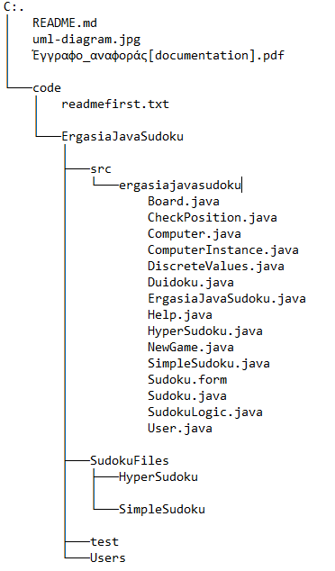
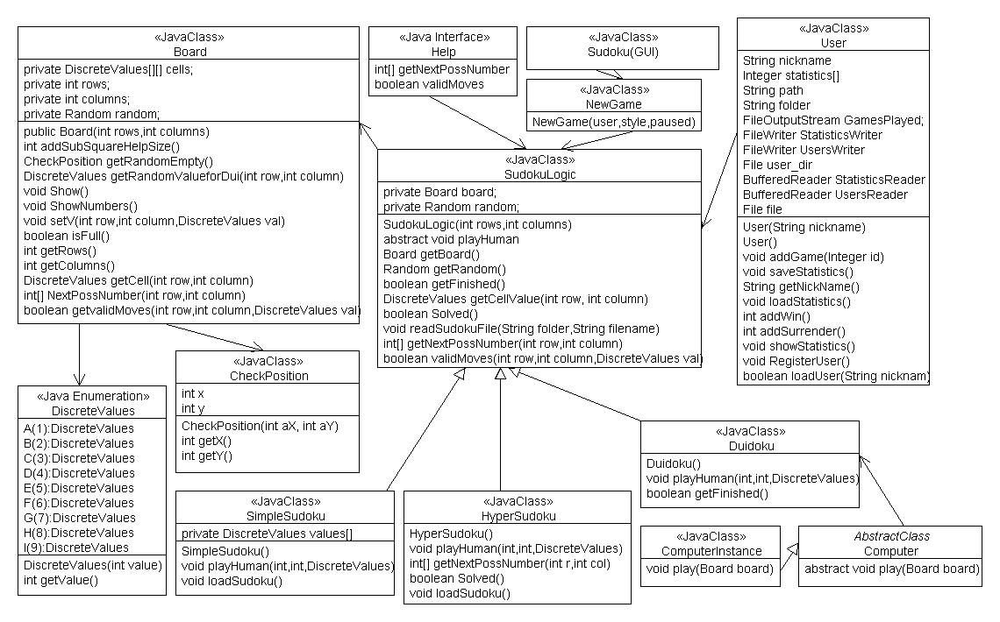

# java_sudoku
implementation of SimpleSudoku, HyperSudoku and Duidocu games using JAVA 

### Notes

This project is implemented for educational purposes... 

Due to the fact that this project lacks in interface implementation, alternatively, indicative code blocks
are provided in the "main" function (ErgasiaJavaSudoku.java) of the program so as that can be used as a manual guide. 

### Contents

### Logic 
This uml-diagram depicts the logic of the program.

### SOS

In order to compile successively the program, the "path" variable ought to be changed appropriately, 
according to the corresponding user's local path, where the program is located.
This variable is located in the class "Users" as a private field 
and also in the class "SudokuLogic" whithin the "readSudokuFile" function.

       
